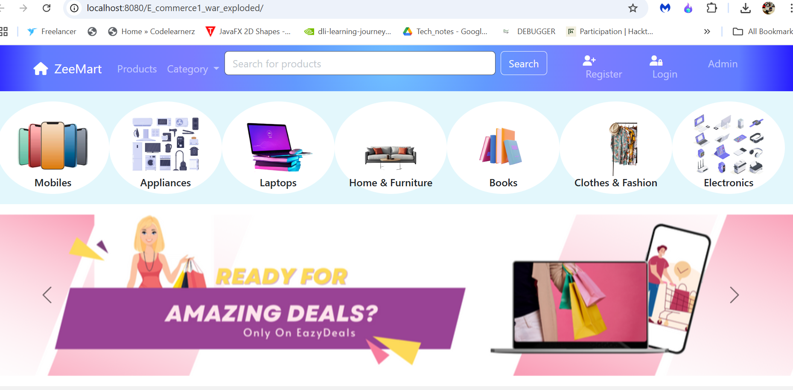
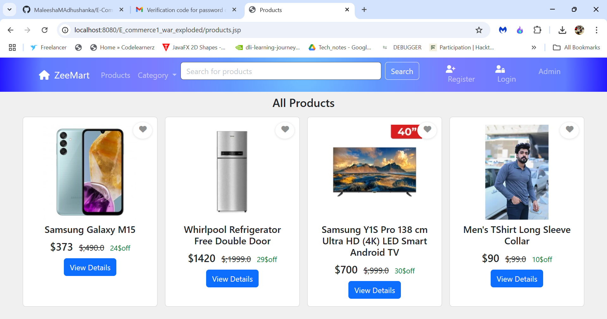
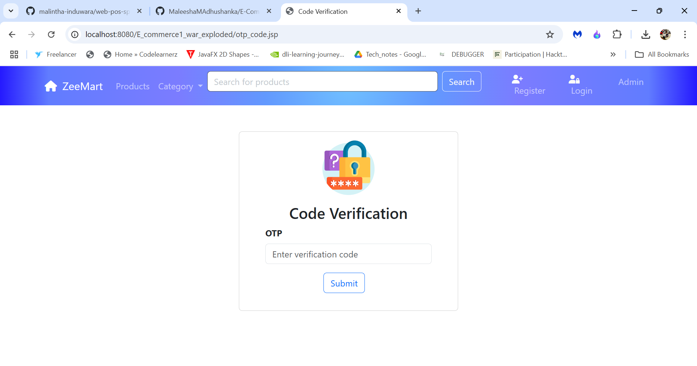
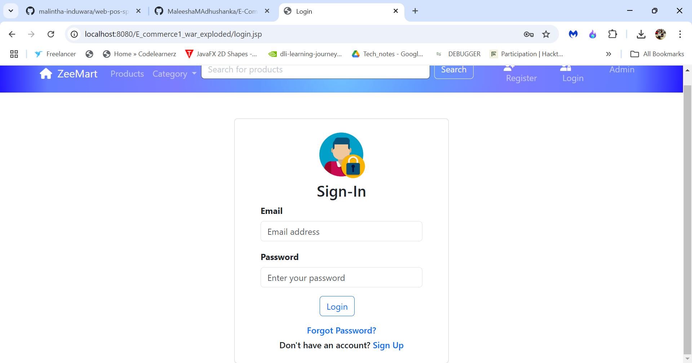
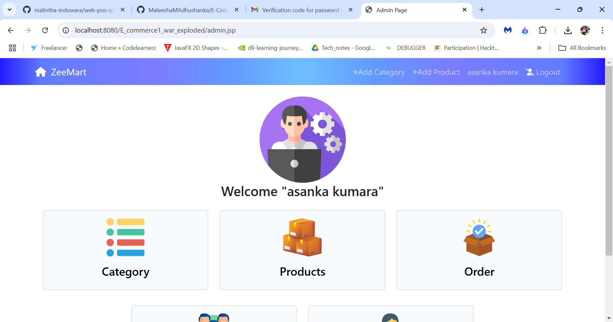
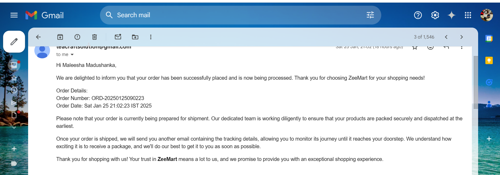

# ZeeMart E-Commerce Web Application

## Project Description
This project is a fully functional e-commerce web application developed using **JavaEE**, **JSP**, **Tomcat**, **MySQL**, and **Maven**, along with front-end technologies like **HTML**, **CSS**, **Bootstrap**, and **JavaScript**. The application provides essential features such as product management, user authentication, shopping cart operations, and order processing. It also integrates email functionality using `com.sun.mail` and `jakarta.mail` for sending notifications to users.*Tomcat Connection Pool** for efficient database

## Features

### Administrator Features
- **Product Management**: Add, view, update, and delete products.
- **Category Management**: Add, view, update, and delete product categories.
- **Order Management**: View all orders placed by customers.
- **User Management**: View, activate, or deactivate customer accounts.

### Customer Features
- **User Authentication**: Registration, login, and logout.
- **Product Browsing**: View products by category, search by name, and sort by price.
- **Shopping Cart**: Add products to the cart, update quantities, and remove products.
- **Order Placement**: Place orders and view order history.
- **User Profile Management**: Update personal information and passwords.

### Email Features
- **Order Confirmation Emails**: Customers receive email notifications upon successfully placing an order.
- **Account Notifications**: Email notifications for registration confirmation, password reset, and account activation/deactivation.
- **Technology Used**:
    - `com.sun.mail` and `jakarta.mail` for sending emails.
    - SMTP server configuration for email delivery.

## Technologies Used

### Back-End
- **JavaEE**: For business logic and server-side operations.
- **JSP**: For server-side rendering of web pages.
- **Tomcat**: As the application server.
- **MySQL**: For database management.
- **Maven**: For project dependency management and build automation.
- **Tomcat Connection Pool**: For efficient database connection management.

### Front-End
- **HTML & CSS**: For creating structured and styled web pages.
- **Bootstrap**: For responsive design and enhanced UI components.
- **JavaScript**: For interactive client-side functionality.

### Email Integration
- **com.sun.mail** and **jakarta.mail** libraries for email functionality.
- Configured SMTP server for sending emails (e.g., Gmail SMTP).

### Database Setup
- **Database Name**: `ecommerce`
- **Tables**:
    - `admin`
    - `cart`
    - `category`
    - `order`
    - `order_product`
    - `product`
    - `user`
    - `wishlist`

## Project Structure
- **Frontend**: Contains HTML, CSS, JavaScript, and JSP pages like `home.jsp`, `product_list.jsp`, `cart.jsp`, and `admin_dashboard.jsp`.
- **Backend**: Implements servlets such as `AddProductServlet`, `LoginServlet`, and `CartServlet` for handling business logic.
- **Email Integration**: Handles email notifications for orders and account activities.
- **Database**: MySQL tables for managing application data.

## Getting Started
Include screenshots of the following key features:
- Home page

- Home page Latest product and hot deals

- All Products

- Create Acount

- Code verification

- Signin

- Admin dashboard

- 
- Admin dashboard

- User Dashboard

- Product Search

- View Product

- Checkout

- Place Order

- Email notifications Place Order

### GitHub Repository
[https://github.com/MaleeshaMAdhushanka/E-Commerce-Site.git](#)

## Bonus Features
- Advanced search with filters (category, keywords).
- User roles and permissions (admin, customer).

---
 
